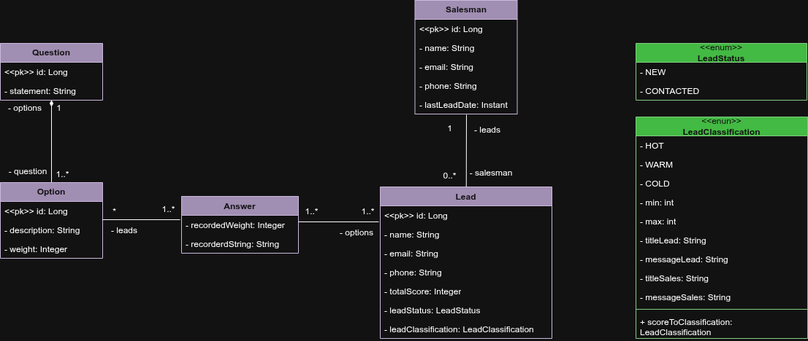

# Lead Manager System 🚀

> **Transformando o "caos" dos leads em uma estratégia de vendas incisiva.**

## 💼 A Dor do Negócio (O Problema)
Muitos empreendedores e equipes comerciais enfrentam o mesmo desafio: recebem um volume alto de contatos (leads) por diversos canais, mas perdem tempo precioso tentando organizar tudo em planilhas ou, pior, abordando as pessoas sem critério. 

A pergunta é sempre a mesma: **"Para quem eu devo ligar primeiro?"**. Sem uma triagem inteligente, leads com alto potencial de compra ("quentes") esfriam enquanto o vendedor perde tempo com curiosos.

## 🎯 A Solução
O **Lead Manager** automatiza essa triagem. Através de um sistema de pontuação dinâmica baseada em formulários, o backend calcula o score de cada lead no momento do cadastro. 

O sistema não entrega apenas dados; ele entrega **prioridade**. O vendedor recebe uma classificação clara (HOT, WARM, COLD) e um roteiro de abordagem sugerido, permitindo uma comunicação muito mais agressiva e eficiente.

---

## 🏗️ Arquitetura e Decisões Técnicas

O projeto utiliza **Modelagem de Domínio Rico** e separa a lógica de inteligência de negócio da simples persistência de dados.

### 🛡️ Smart Enums & Integridade
Diferente de sistemas básicos, utilizamos **Enums Turbinados** para `LeadStatus` e `LeadClassification`.
- **Mapeamento por Código:** Garantimos que o banco de dados seja imutável e seguro contra renomeações no código Java.
- **Metadados de Contexto:** Cada classificação carrega seu próprio "bundle" de informações: rótulos para o front-end e descrições estratégicas específicas para o vendedor e para o cliente.

### 🧠 Cálculo no Service
A inteligência de pontuação reside exclusivamente na camada de **Service**. Ao persistir o `totalScore` no banco, permitimos que o vendedor ordene sua lista de contatos instantaneamente, focando no que realmente traz retorno financeiro.

### 📊 Diagrama UML

*(O mapa que guia a construção das entidades, relacionamentos e a classe associativa de respostas)*

---

## 🛠️ Tecnologias Utilizadas

* **Linguagem:** Java 25 
* **Framework:** Spring Boot 3.4+
* **Persistência:** Spring Data JPA / Hibernate
* **Banco de Dados:** * 
	**H2 Database:** Desenvolvimento e testes rápidos.
    * **PostgreSQL:** Produção e persistência robusta.
* **Ferramentas:** Lombok, Bean Validation, Maven.

---

## ⚙️ Como Rodar o Projeto

### 1. Pré-requisitos
* JDK 25 instalado.
* Maven configurado no Path.

### 2. Variáveis de Ambiente
Para proteger o acesso ao banco de dados em produção, configure:
- `DB_PASSWORD`: Senha do seu banco PostgreSQL.

### 3. Execução (Padrão H2)
1. Clone o repositório.
2. Execute `./mvnw spring-boot:run` ou rode a classe principal via sua IDE preferida.
3. O sistema povoará automaticamente as perguntas e opções iniciais via `CommandLineRunner`.
4. Acesse o console do H2 em: `http://localhost:8080/h2-console`

---

## 👨‍💻 Autor

**Miguel Pazatto** *Estudante de Engenharia de Software* [www.linkedin.com/in/miguel-pazatto]