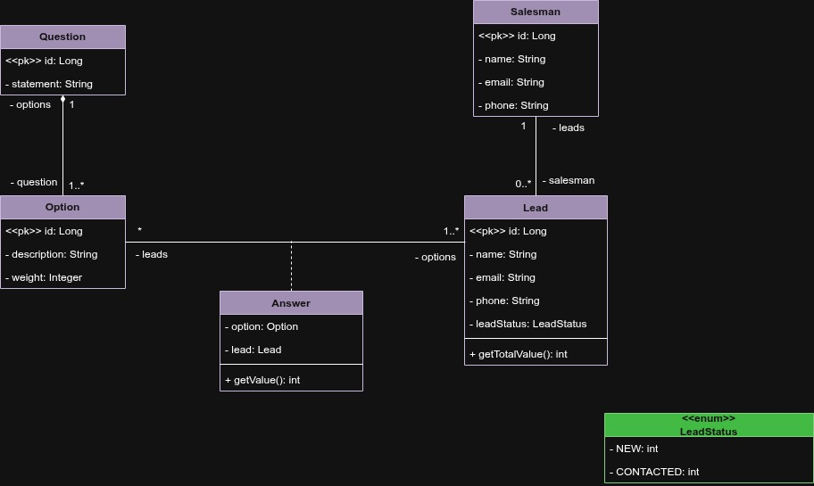

# Lead Manager System 🚀

Sistema de backend desenvolvido para gerenciamento, triagem e pontuação de leads. O projeto foca em automatizar a qualificação de potenciais clientes para facilitar o trabalho de equipes de vendas.

## 🏗️ Arquitetura do Sistema
O projeto foi planejado utilizando os princípios de modelagem de domínio. Abaixo está o diagrama UML que guia a construção das entidades e relacionamentos:

 
*(Dica: salve seu diagrama na pasta doc/ com esse nome para ele aparecer aqui)*

## 🛠️ Tecnologias Utilizadas
- **Linguagem:** Java 25
- **Framework:** Spring Boot 3.4+
- **Gerenciador de Dependências:** Maven
- **Persistência:** Spring Data JPA / Hibernate
- **Bancos de Dados:** 
  - H2 Database (Ambiente de Teste/Dev rápido)
  - PostgreSQL (Ambiente de Produção/Dev persistente)
- **Outros:** Lombok, Bean Validation

## ⚙️ Como Rodar o Projeto

### Pré-requisitos
- JDK 25 instalado.
- Maven configurado no Path.
- (Opcional) PostgreSQL instalado localmente.

### Variáveis de Ambiente
Para segurança das credenciais, o projeto utiliza variáveis de ambiente. Certifique-se de configurar em sua IDE ou Sistema Operacional:
- `DB_PASSWORD`: Senha do seu banco de dados PostgreSQL.

### Rodando com H2 (Padrão de Teste)
O projeto está configurado para iniciar por padrão com o banco em memória H2.
1. Clone o repositório.
2. Execute `./mvnw spring-boot:run` ou rode a classe principal via Eclipse/IntelliJ.
3. Acesse o console do H2 em: `http://localhost:8080/h2-console`

## 👨‍💻 Autor
**Miguel Pazatto** Estudante de Engenharia de Software
[LinkedIn](https://www.linkedin.com/in/miguelpazatto/)