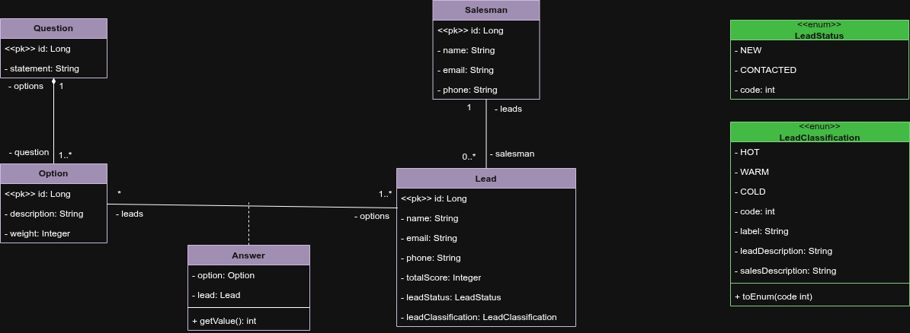

# Leads Manager API 🚀

Uma API RESTful desenvolvida para otimizar e escalar a produtividade de times de vendas. Criada com o propósito de atender startups, o sistema transforma simples formulários web em canais de comunicação inteligentes, qualificando potenciais clientes de forma totalmente automatizada.

## 🎯 O Problema que Resolve
Times de vendas perdem muito tempo analisando contatos frios. O Leads Manager recebe os dados do formulário do site e aplica uma inteligência de pontuação instantânea, entregando para o vendedor uma lista priorizada e dicas de abordagem personalizadas.

## 🧠 Regra de Negócio: Motor de Classificação (Scoring)
O grande diferencial da API é o seu motor de qualificação dinâmico:
1. **Pesos e Respostas (`Answers`):** Cada opção de um formulário tem um peso (`weight`). Quando um lead é submetido, o sistema gera uma lista de `Answers` (entidade associativa) que registra e "congela" o peso daquela opção no momento exato da criação.
2. **Cálculo (`totalScore`):** Um método interno utiliza Lambdas/Streams para somar todos os pesos e calcular o Score Total do Lead.
3. **Classificação Enum-Driven:** O `totalScore` é repassado para o Enum `LeadClassification`. É o Enum que detém a responsabilidade de avaliar a margem de pontos e retornar a classificação correta.
4. **Lógica de Temperatura:** Baseado na dor do cliente, **quanto menor a pontuação** (indicando baixa performance do lead ao conciliar CPF e CNPJ), **mais "Quente" (HOT) é o lead**.
5. **Mensageria:** O próprio Enum encapsula mensagens customizadas: uma é enviada ao front-end para o usuário, e outra é exibida ao vendedor com uma sugestão de abordagem.

## 🏗️ Modelagem do Domínio (Core Business)
Abaixo está o diagrama de classes focando estritamente na regra de negócio e no motor de pontuação.

## 🛠️ Tecnologias Utilizadas
* **Linguagem:** Java 21
* **Framework:** Spring Boot 3
* **Banco de Dados:** PostgreSQL
* **Migrações:** Flyway
* **Segurança:** Spring Security + JWT
* **Deploy/Nuvem:** Railway

## 🌐 Demonstração ao Vivo (Live API)
**URL Base:** `https://leads-manager-production.up.railway.app`

**Credenciais de Visitante (Acesso de Leitura):**
* **Login:** `visitant`
* **Senha:** `demo123`

## 📦 Exemplos de Requisição (Payloads)

### Autenticação (Gerar Token)
`POST /auth/login`
json
{
  "login": "visitant",
  "password": "demo123"
}

### 📦 Cadastro de um Novo Lead (Público)

`POST /leads`

**Regras de Validação (DTO):**
* **name**: Preenchimento obrigatório.
* **email**: Formato de e-mail válido.
* **phone**: Apenas números, mínimo de 11 caracteres.
* **optionId**: A lista de IDs das opções não pode ser vazia.

**Exemplo de JSON (Request Body):**
json
{
  "name": "Startup Inovadora Ltda",
  "email": "contato@startup.com",
  "phone": "16999999999",
  "optionId": [1, 4, 7] 
}

### 📍 Mapeamento de Rotas

#### Públicas (PermitAll)
* **GET /leads/public/{id}**: Retorna a mensagem de feedback amigável do sistema para o usuário final.

#### Autenticadas (Requerem Token JWT)
* **GET /leads**: Lista todos os leads captados com classificações e scores.
* **GET /leads/{id}**: Detalha o histórico e as respostas de um lead específico.
* **PATCH /leads/{id}/contacted**: Altera o status de um lead de `NEW` para `CONTACTED`.

## 🔜 Próximos Passos
- [ ] Implementação de Testes Unitários e de Integração (JUnit 5 e Mockito).
- [ ] Documentação automatizada com Swagger / OpenAPI.